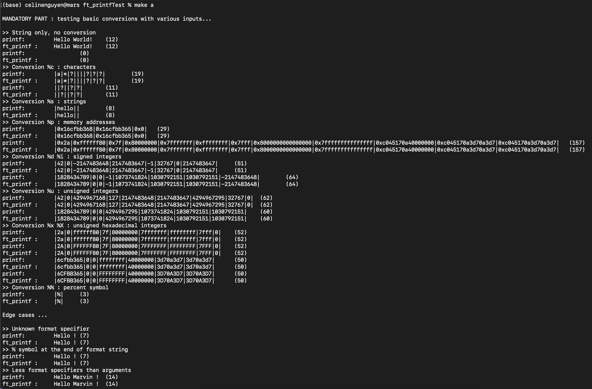

# ft_printfTest

This is a basic program to test your ft_printf project. As for now, it uses your `ft_vprintf` and not `ft_printf`, so make sure you have implemented it in your library before using this program. If not, it is the simplest thing to code in this project, once you undestood how it works, there's only a few lines to add/modify in your code. This program uses your `ft_vprintf` function and tests it against the `vprintf` in your machine on a wide range of cases. These include basic tests and thorough tests on edge cases, non-standard behavors and overflows. The Moulinette won't be testing all of them, but if you've read the subject and the man, you should be able to know which ones are important to pass the project. This test program also allows you to make your own test cases in the file `custom_tests.c`.

# Usage

Git clone this repository at the root of the project repository where your Makefile and libftprintf.a must be located. If your file structure is different, modify their path in the Makefile. 

## Run tests

* `make` or `make a` - run mandatory and bonus tests \
* `make m` - run mandatory tests \
* `make b`- run bonus tests \
* `make custom` - run custom tests (you can change the file `custom_tests.c`)
* `make fclean` - remove all object files and binaries created for this test

## Example

## Improvements to-do list

- [ ] Add option to ignore tests not required by the subject.
- [ ] Make the program use `ft_printf` instead of `ft_vprintf`.